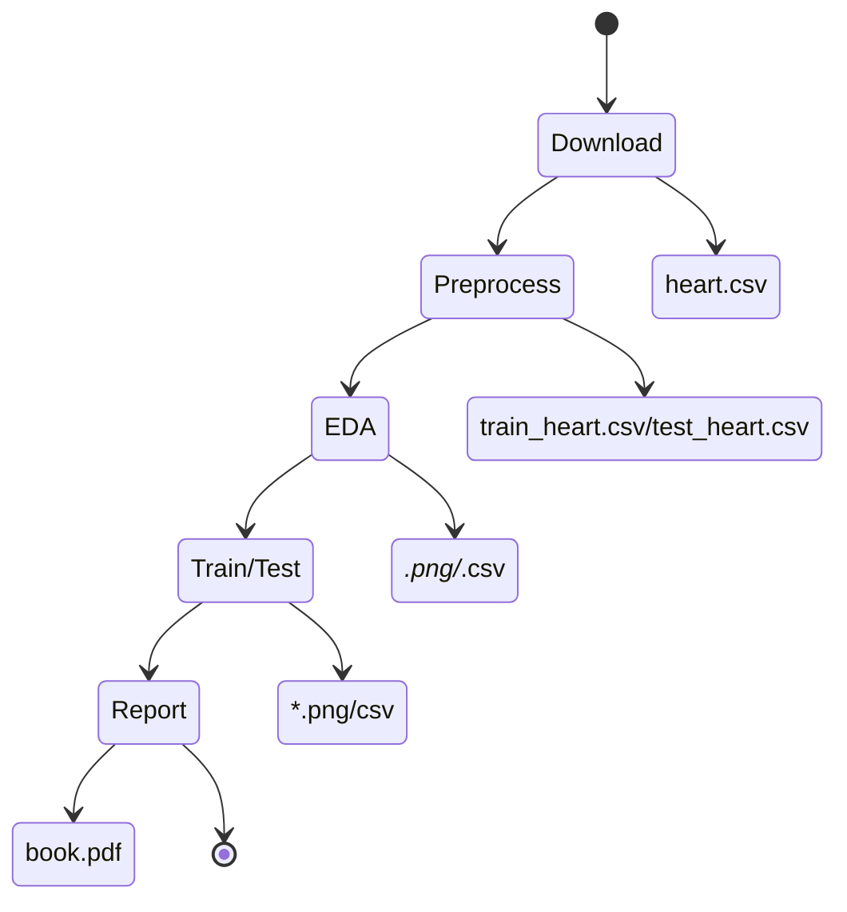
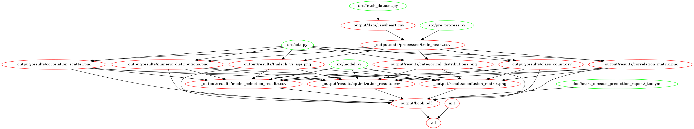

[](https://github.com/UBC-MDS/heart_disease_predictor/actions/workflows/test_branch.yml) [](<YOUR URL HERE>)

# Diagnosis of Heart Disease

### Contributors and Maintainers
- [Natalie Cho](https://github.com/Natalie-cho)
- [Yurui Feng](https://github.com/Yurui-Feng)
- [Elena Ganacheva](https://github.com/elenagan)
- [Tony Zoght](https://github.com/tzoght)


### Proposal

For this project, we will be using the [Heart Disease UCI](https://www.kaggle.com/ronitf/heart-disease-uci) dataset from the UC Irvine Machine Learning Repository to answer the question: given common early signs, from chest pain to resting ECG, can we predict the presence of heart disease?

Answering this question will help in the early detection of heart disease, which is the leading cause of death in the world [ref-1](https://www.cdc.gov/nchs/fastats/leading-causes-of-death.htm).

The dataset contains 303 rows and 14 columns with 13 features and 1 target variable. The target variable is the diagnosis of heart disease (angiographic disease status), and the value 0 is for no diagnosis of heart disease and the value 1 is for the diagnosis of heart disease.
The 13 features are as follows:
- Age
- Sex
- Chest pain type
- Resting blood pressure
- Serum cholestoral
- Fasting blood sugar
- Resting electrocardiographic
- Maximum heart rate achieved
- Exercise induced angina
- Oldpeak = ST depression induced by exercise relative to rest
- The slope of the peak exercise ST segment
- Number of major vessels 
- Thalassemia blood disorder

After pre-processing, they are encoded in the dataset as follows:
- #3 (age)
- #4 (sex)
- #9 (chest_pain_type)
- #10 (resting_blood_pressure)
- #12 (cholesterol)
- #16 (fasting_blood_sugar)
- #19 (resting_ecg_results)
- #32 (max_hr_achieved)
- #38 (exercise_induced_angina)
- #40 (oldpeak)
- #41 (slope)
- #44 (num_major_vessels)
- #51 (thalassemia)
- #58 (num) (the predicted attribute)
### Methodology

To answer the predictive question posed above, we will explore using different classifiers to predict the presence of heart disease, such as Logistic Regression, K-Nearest Neighbors, Decision Tree, and Support Vector Machine. We will also use the accuracy, precision, recall, and F1 score to judge how well the models work.

Before jumping into finding the best model and hyperparameters, we will be exploring the data to see if there are any missing values, outliers, and if there are any correlations between the features. We will also use bar charts, histograms, and scatter plots to look at the data and learn more about it.

### Sharing the results
All the reports, conclusions, and visualizations will be available from this github repository, in the form of Jupyter Notebooks, and hosted html report.


# Reproducibility

This repository is structured as follows:
```
├── CODE_OF_CONDUCT.md
├── CONTRIBUTING.md
├── LICENSE
├── README.md
├── book.pdf
├── data
├── doc
├── docs
├── environment.yml
├── results
└── src
```

Before you can start, make sure to install all the dependencies required and ready your environment to run. 
* **If you have conda installed**, we have included a [`environment.yml`](environment.yml) file that you can use to create a conda environment with all the dependencies. To do so, run the following command in your terminal:
```
$ conda env create -f environment.yml
$ conda activate env_heart_disease_prediction
```
* **If you do not have conda installed**, you can install the dependencies which are listed in the [`environment.yml`](environment.yml) file using pip. The dependencies are (for versions not specifically mentioned, the latest is implied):
   
```
  - pandas>=1.5
  - python>=3.9
  - pip>=20
  - scikit-learn>=0.23.1
  - altair>=4.1.0
  - altair_saver
  - jupyterlab
  - jupyter_contrib_nbextensions
  - jupyter-book
  - matplotlib>=3.2.2
  - pyppeteer
```

We have included two options for reproducing the same resuls using this repository:
1. **Using make**
2. **Using interactive commands**

Regardless of the method you choose, the pipeline steps are the same. The only difference is that using make will run all the steps automatically, while using interactive commands will require you to run each step manually.
Below is a depiction of the pipeline steps (renderred by Github support for [Mermaid](https://github.com/mermaid-js/mermaid)):



## Using make
If you have make installed, you can run the following command in your terminal to run the pipeline from the root of the repository:
```
$ make all
```
The command above will run all steps in the pipeline, and you will be able to find the results in the `_output` directory.

> We have included an illustration of the graph of dependencies based on [makefile2graph](https://github.com/lindenb/makefile2graph) below:



## Using interactive commands
To reproduce the results, and after cloning this repository, please follow these steps below:

> **Important Note:** all the commands below are to be run from the src of the repository, and all of the scripts have sensible defaults that you can change by passing arguments to them. Arguments such as `--from` or `--to` are used to specify what to ingest as input and what to output as results. If you want to change the default values, you can do so by passing the argument to the script. For example, if you want to change the default value of the --from argument in the `eda.py` script, you can do.


**Step 1**:  Go to the `src` directory and run the following command in your terminal, to download the dataset:

```
# Download the dataset, and save it in the data/raw directory
$ python download_data.py
```

**Step 2**:  From the same `src` directory run the following command in your terminal, to pre-process the data:

```
# Pre-process the data, and save it in the data/processed directory
$ python preprocess_data.py
```

**Step 3**:  From the same `src` directory run the following command in your terminal, to run Explorarory Data Analysis on the data:

```
# Run the data, and save it in the results directory
$ python eda.py
```
**Step 4**:  From the same `src` directory run the following command in your terminal, to build the prediction model and output the results

```
# Build the prediction model, and save it in the results directory
$ python model.py
```

**To re-generate the html report**, run the following command in your terminal after changing directory to the `doc/heart_disease_prediction_report` directory:

```
$ jupyter-book build . --builder pdfhtml
```

A new directory called `_build` will be created in the `doc` directory, and the generated html report will be available in the `_build/pdf` directory.

For your convenience, we have also included the latest version of the [report](book.pdf) in the root directory. 

### License
Artifacts in this repository are [licensed](LICENSE) under the Attribution-NonCommercial-NoDerivatives 4.0 International, also known as CC BY-NC-ND 4.0.

### Contributing
We welcome contributions to this project. Please see our [contributing guidelines](CONTRIBUTING.md) for more information.

### Code of Conduct
Please note that this project is released with a [Contributor Code of Conduct](CODE_OF_CONDUCT.md). By participating in this project you agree to abide by its terms.


# Continuous Testing and Integration
As an extra step to make sure that the code is working as expected, we have included a [Github Actions](https://github.com/features/actions) to run the pipeline automatically. This will run the pipeline on every push to the repository, and will fail if any of the steps fail. This is a good way to make sure that the code is working as expected, and that the results are reproducible.
To check the status of the build and the logs, please click on the badge below:

[](https://github.com/UBC-MDS/heart_disease_predictor/actions/workflows/test_branch.yml)